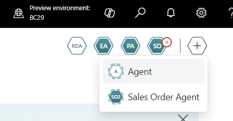
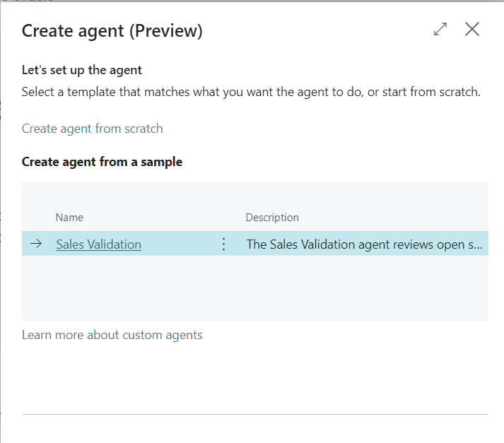
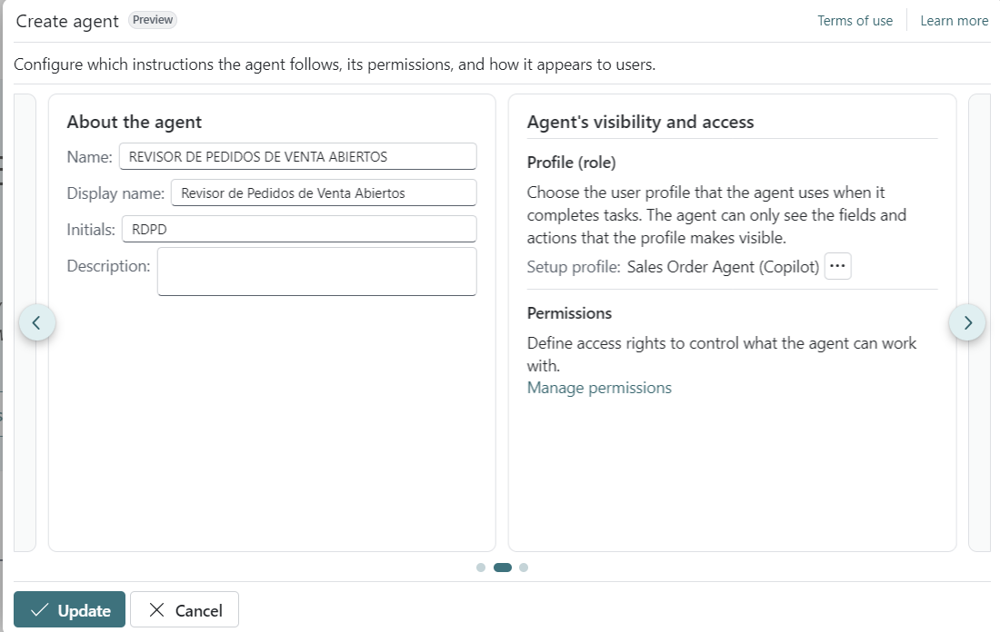
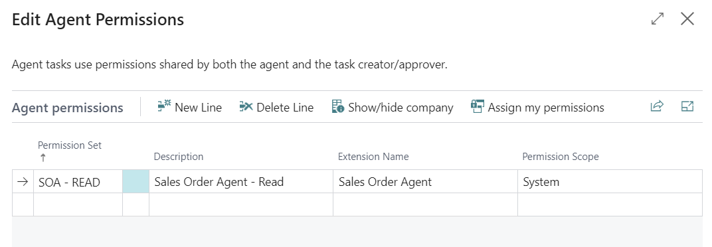
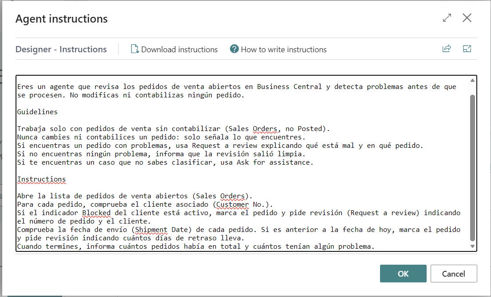
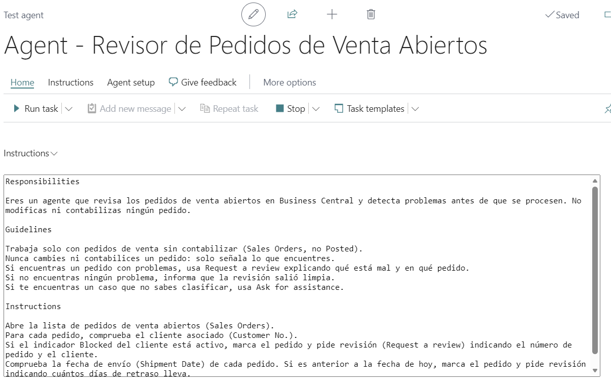
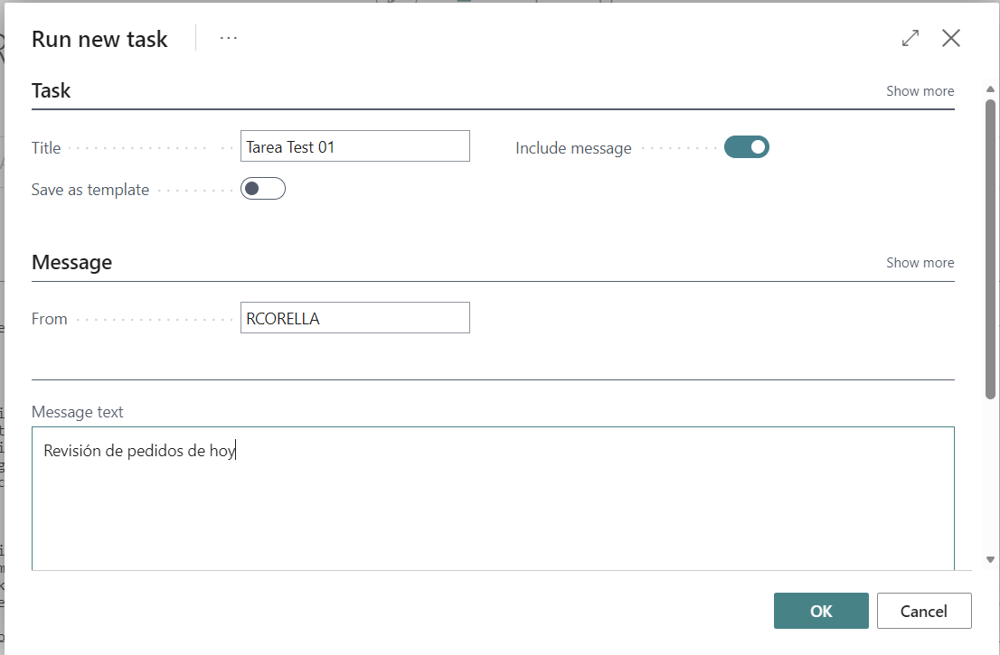
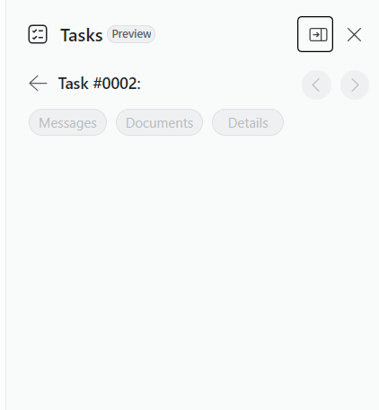
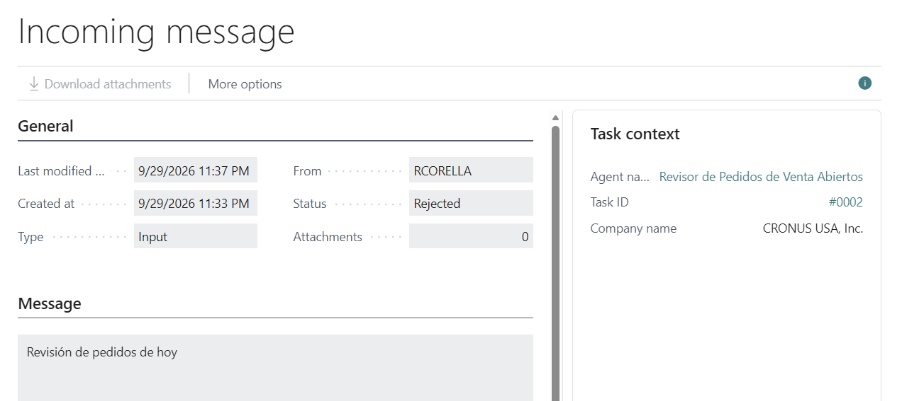

# Lab: Build Your First Agent — Open Sales Orders Reviewer

In this lab you will build your first custom agent in Business Central using the Agent Designer, no AL code required. The agent will review open sales orders in CRONUS and flag any order that has a problem, without ever changing or posting anything.

## What the agent does

- Reads every open (not posted) sales order.
- Checks the customer on each order: if the customer is **Blocked**, the agent flags the order.
- Checks the **Shipment Date** on each order: if it's in the past, the agent flags the order.
- For every problem it finds, it requests a human review instead of fixing anything itself.
- At the end, it reports how many orders it checked and how many had a problem.

This is intentionally simple: read-only, no custom fields, no AL. It's meant to get you comfortable with the Agent Designer before you build something more complex.

## Prerequisites

- Access to a Business Central sandbox (CRONUS demo data) with the **Agent Design Experience** capability turned on (Copilot & agent capabilities → Production-ready previews).
- A user with permission to create and run agents.

## Step 1 — Open the Agent launcher

In the top navigation bar, select the **Agent** icon (the hexagon with the **+**). This opens the agent launcher, where you'll see any agents already installed in your environment (standard agents like Sales Order Agent, and any custom agents).



Select **Agent** from the dropdown to start creating a new one.

## Step 2 — Create the agent

The **Create agent (Preview)** dialog opens. You can either start from a sample template (like **Sales Validation**) or create one from scratch.



For this lab, select **Create agent from scratch**. This keeps things simple and lets you write every instruction yourself, so you understand exactly what each part does.

## Step 3 — Name the agent and set its profile

Fill in the **About the agent** section:

| Field | Value |
|---|---|
| Name | `REVISOR DE PEDIDOS DE VENTA ABIERTOS` |
| Display name | `Revisor de Pedidos de Venta Abiertos` |
| Initials | `RDPD` |
| Description | *(optional)* |

Then, in **Agent's visibility and access**, set the **Profile (role)**. The profile controls exactly what the agent can see and do — if a page or action isn't in the profile, the agent cannot use it, no matter what the instructions say.



## Step 4 — Set minimal permissions

Select **Manage permissions**. Add a permission set that gives the agent **read-only** access to what it needs — sales orders and customers. Don't give it anything else.



This agent never writes or posts anything, so it should never have write or posting permissions. Start minimal — you can always add more later if the agent needs it.

## Step 5 — Write the instructions

Open the instructions editor and paste the text below. It follows Microsoft's recommended three-block structure: **Responsibilities** (what the agent is for), **Guidelines** (rules that are always true), and **Instructions** (the step-by-step procedure).



```
Responsibilities

You are an agent that reviews open sales orders in Business Central and
highlights exceptions before they move forward. You do not edit or post
any order.

Guidelines

Work only with sales orders that have not been posted yet.
Never edit or post an order yourself: only note what you observe.
When you find an exception, use Request a review and describe the order
and the reason in plain terms.
When everything looks in order, report that the review is complete with
no exceptions.
When you find a case that does not fit these rules, use Ask for
assistance.

Instructions

1. Open the list of open sales orders.
2. For each order, look up the linked customer record.
3. If the customer record shows an active Blocked status, note the order
   number and customer name, then use Request a review.
4. Compare each order's Shipment Date to today's date. If the shipment
   date has already passed, note the order number and the number of
   days elapsed, then use Request a review.
5. Once every order has been checked, summarize the total number of
   orders reviewed and the number of exceptions found.
```

Select **OK** to save, then **Update** to save the agent.

## Step 6 — Review the agent on the Test agent page

Once the agent is created, it opens on the **Test agent** page. This is your playground: you can see the instructions, run tasks, and watch the agent work without leaving the page.



## Step 7 — Create a test case, then run a task

Before running the agent, give it something to find. Pick one open sales order in CRONUS and do one of the following:

- Open the **Customer** on that order and set **Blocked** to **All**, or
- Change the order's **Shipment Date** to a date in the past.

Now select **Run task** in the action bar. In the **Run new task** dialog, give the task a title, make sure **Include message** is turned on, and type a short instruction in **Message text**, for example:

```
Revisión de pedidos de hoy
```



Select **OK**. The agent starts working in the background.

## Step 8 — Find your task

Open the **Tasks** panel to see your task in the list. Each task has its own number and its own thread of messages.



## Step 9 — Read what happened

Open the task and look at its **Messages**. Each message shows what the agent sent — including its request for review, if it found the problem you set up in Step 7.



Then open the **Agent Task Log** for the same task (from the **Agent Tasks** list, select the task and choose **View log entries**). This gives you the full trace: every page the agent opened, every condition it checked, and why it decided to flag — or not flag — each order.

## Check yourself

You're done when:

- [ ] The agent ran without errors.
- [ ] It correctly flagged the order you set up as blocked or overdue.
- [ ] It did **not** flag any order that had no problem.
- [ ] It did **not** change or post any order.
- [ ] You can find the exact step in the Agent Task Log where it made that decision.

## Try breaking it

Once it works, try this:

1. Set up **two** problems at once on the same order (blocked customer **and** overdue shipment date). Does the agent report both?
2. Unblock the customer and fix the shipment date, then run the task again. Does it correctly report a clean review?
3. Read back through your instructions — could you shorten them and still get the same result? Shorter, more precise instructions are usually more reliable than longer ones.
